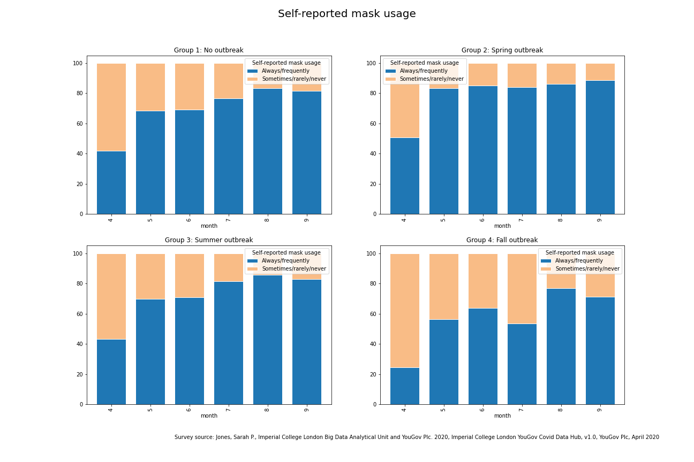

# covid-19-geographic-analysis

</img>

## Overview
This repo is an ongoing project to explore the geographic patterns in the COVID-19 pandemic with particular focus on the US. The goal is to identify meaningful observations that could potentially be used by entities that are seeking to control and/or respond to the crisis.

This is an ongoing project that began in mid August 2020. New information will be added soon. Please recognize that the ideas and reasearch in this repo are a work in process. Back in August, the analysis focused on comparing the geographic distribution of HIV to the geographic distribution of COVID-19 since the distributions were similar at that time. These results were kept in the Github repo as a timepoint reference even though the geographic distribution of COVID-19 has since evolved.

## Goals

The goals of this project are:
> - To look for meaningful patterns in the geogrpahic progression of the COVID-19 pandemic
> - To work with various EDA and data visualization tools and techniques

## Tools and techniques used in this project
- **Tools**
> - Python, Jupyter Lab, SciKitLearn, Pandas, Numpy
- **Visualization**
> - Plotly, Matplotlib
- **Techniques**
> - Supervised learning model development, spatial mapping, simple moving average

## COVID-19 trend analysis

### Data and EDA
Data for the COVID-19 trend analysis was obtained from the following sources:
- [the COVID Tracking Project](https://www.covidtrackingproject.com), Creative Commons CC BY 4.0 license
- Jones, Sarah P., Imperial College London Big Data Analytical Unit and YouGov Plc. 2020, Imperial College London YouGov Covid Data Hub, v1.0, YouGov Plc, April 2020
For the US data, state groupings were created for outbreaks of similar scale and timeframe. States were grouped into one of four categories:
- Spring outbreak
> - Occurred primarily in the northeast, Michigan, and Louisiana
> - Exceeded 40 cases per 100,000 per day or 0.8 deaths per 100,000 per day before May
> - About 80M people are in this group
- Summer outbreak
> - Occurred primarily in the southeast and Arizona
> - Exceeded 40 cases per 100,000 per day or 0.5 deaths per 100,000 per day between June and August
> - About 80M people are in this group
- Fall outbreak
> - Upper midwest and Arkansas at this time with more states to be added if they meet the threshholds
> - Exceeded 40 cases per 100,000 per day or 0.5 deaths per 100,000 per day after August
> - About 11M people are in this group
- No outbreak
> - Avoided classification in one of the other outbreak categories
> - About 160M people are in this group

Case and death data was smoothed using a 14 day simple moving average since the daily reports are quite noisy.
### Findings and comments

</img>

This chart reveals a number of interesting patterns.

> - While the *spring outbreak* was occurring, the infection rate was surprisingly uniform among the other groups.
> - The *summer outbreak* emerged quickly. The *fall outbreak* group and *no outbreak* group maintained comparable infection rates even as the the rates crept up (perhaps due to states easing restrictions en masse). The reported infection rate for the *summer outbreak* group suprassed that of the *spring outbreak*. This could be explained in part by increased testing.
> - The *fall outbreak* ramped up quickly as well. It appears to be headed towards a higher peak than either of the two previous outbreaks. Fortunately, this outbreak is affecting a much smaller portion of the US population than the previous two at this time.
> - The rapid ramp-ups of the summer and fall outbreaks suggest an early warning system may be necessary to *see* an emerging outbreak before its too late. By the time the trends start to change in the case rate data it may be too late to avoid an outbreak. 

</img>

Deaths are the most important measure of severity of the outbreak.

> - The impact of the outbreaks are clearly visible in the charts. The shaded area in the chart above represents the cost in terms of lives lost from the summer outbreak. This outbreak led to an additional 23,000 lives lost as compared to baseline. 
> - Governments and public health agencies are unlikely to drive the death rate down to zero until a vaccine is available, but they can work to avoid an outbreak to avoid the associated costs of lives lost.
> - *Deaths per 100,000* was much smaller for the second outbreak than the first.
> - It's too early to say what the death rate will look like for the third outbreak. Recent news reports--which are not yet reflected in the data--suggest the death rate may end up being worse. Over the past several days, the Dakotas reported death rates exceeding 0.5 people per 100,000.

</img>

Note that the reported death time series was shifted forward by 14 days to synchronize up better with the case time series so that an accurate case fatality ratio could be calculated.
What are the takeaways from this chart?

> - The case fatality ratio has been reduced significantly from the early days of the pandemic. This can probably be attributed to several factors. For one, much more testing is being done, so fewer cases are being missed. For two, the medical community knows much more about how to care for patients with the disease, which has probably led to better outcomes. 
> - The case fatality ratio crept up a bit for the summer outbreak group, but otherwise hasn't seen marked changes after spring ended. There's no strong indication that summer's crowded hospitals had a major impact on case fatality--at least in this slice of the data.

</img>

Masks are touted as an easy preventative measure. The Imperial College of London in conjunction with YouGov Plc have been conducting an ongoing large-scale global study of how people are responding to the COVID-19 situation. They have conducted more than 30,000 surveys in the US alone. Among other things, these surveys collect data on self-reported mask usage. The state groupings that were applied above were used to group the mask survey data.

> - People surveyed in the *spring outbreak* states reported the highest level of mask usage across all months. 
> - People surveyed in the *summer outbreak* states and *no outbreak* states reported very similar mask usage over time.
> - The *fall outbreak* group had the lowest self-reported level of mask usage of any group for all time periods. 

### Areas for further study

- Describe and then model an *early warning system* that could identify when the infection rate for a region such as a state is threatening to become an outbreak.
- Analyze data from other regions of the world that have seen outbreaks with similar timing such as Europe.
- Analyze other behavioral attributes such as mobility.
- Develop a predictive model using the features of baseline infection rate, timing, geographic proximity to other outbreak locations, mask usage, mobility.

## HIV prevalence/COVID-19 incidence comparison

### Data and EDA

For the HIV prevalence/COVID-19 incidence comparison, data on HIV and COVID infection rates were obtained from the following sources:
- https://github.com/nytimes/covid-19-data (COVID incidence by county data) 
- https://gis.cdc.gov/grasp/nchhstpatlas/main.html (HIV incidence/prevalence) 
- EDA of the HIV incidence rates (number of new infections in a given year) revealed a lot of missing data at the county level, and low numbers for many other counties. A decision was made to use prevalence as the comparative marker of the disease. Prevalence--while not perfect--is the most accurate measure of the penetration of the disease. The downsides are that it doesn't necessarily indicate where the disease was contracted since people are mobile. 
- For COVID, incidence is the only measure that makes sense since it is not a persistent illness. 
- Fortunately, HIV is much less common than COVID, so incidence numbers are smaller--even nonexistent (or at least not reported) in many counties. 
- Spatial maps and a scatter matrix were created to compare COVID incidence rates by county to HIV prevalence by county. The spatial maps appear to show commonality of the infection distributions, but the scatter matrix demonstrates that the regional strength of signal may not translate down to the county level. I.e. while the map suggests a strong geographic trend, the trend may not be as apparent at the county level. Perhaps there's too much point variation.
- It was hypothesized that this problem could be addressed by regionalizing the data by creating KNN Regressor predictions. 
<!-- - Maps can be accessed by clicking on the links below. -->
- HIV prevalence by county (active plotly maps aren't available for markdown)
</img>

<pre>

</pre>  
- COVID incidence (as of July 31, 2020) by county
</img>

<!-- - [HIV Prevalence Spatial Map]('img/hiv_prev_map.png')
- [COVID Incidence Spatial Map]('img/July_31_covid_map.png') -->
<pre>

</pre>
### Results
- KNN Regressor models were created to create an epidemic predictor from the covid data and separately for the hiv data. A KNN of 10 was used to 'regionalize' the hiv data and the covid data.
- These KNN prediction mappings appear to show a much stronger regional pattern. The R^2 for these maps is .65, suggesting a moderate correlation (see graph at top of page).
- Regionalized HIV prevalence
</img>
<pre>

</pre>  
- Regionalized COVID incidence
</img>
<pre>

</pre>
<!-- - Prediction maps can be accessed by clicking on the links below. -->
<!-- </img>
</img> -->

<!-- - [HIV Prediction Map]('img/hiv_epidemic_prediction.html')
- [COVID Prediction Map]('img/covid_epidemic_prediction.html')
- [Scatter Matrix]('img/prediction-scatterplot.png') -->

## Contributors
[Rob Salvino](https://github.com/salvir1)

## License
[MIT ©](https://choosealicense.com/licenses/mit/)
